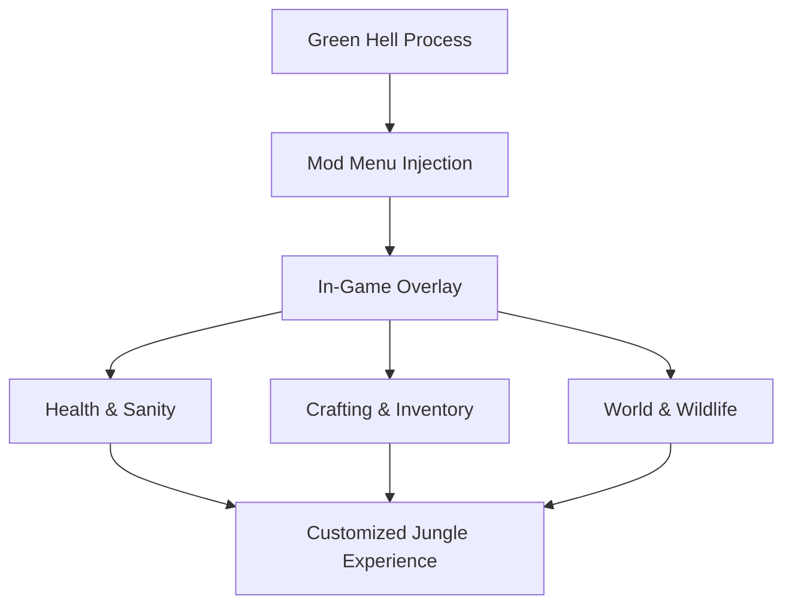

# Green Hell Mod Menu

Green Hell is not cruel by accident.
It is precise. Patient. Unforgiving in silence.
The jungle watches, counts your mistakes, and waits for the smallest weakness.

**Green Hell Mod Menu** doesn’t tame the jungle.
It hands you a compass inside it.

---

## 🌿 Overview

Green Hell Mod Menu is a **persistent in-game overlay** that gives you direct, adjustable control over survival systems in real time. Unlike simple trainers, the menu stays with you — a quiet panel of sliders and toggles that lets you decide how intense, how realistic, or how forgiving the rainforest should be.

Some days you test yourself.
Other days, you study the jungle without fear.

Both are valid ways to survive.

---

## 🧩 Mod Menu Features

### ❤️ Health & Body Control

* God Mode toggle
* Infinite health
* Disable wounds, parasites, infections
* Instant injury recovery

### 🧠 Sanity & Mental State

* Freeze sanity level
* Disable hallucinations
* Prevent sanity drain
* Instant sanity restoration

### 🍖 Hunger, Thirst & Stamina

* No hunger
* No thirst
* Infinite stamina
* Temperature resistance (heat & rain)

### 🪓 Crafting & Inventory

* Free crafting (no materials required)
* Instant crafting completion
* Tool durability lock
* Infinite carry weight

### 🌍 World & Wildlife

* Time control (pause / slow / fast)
* Freeze time of day
* Reduce or disable animal aggression
* Safe exploration mode

[!NOTE]
Every option is modular. You can soften one system while keeping others brutally real.

---

## ⚡ How It Feels to Use

1. Launch Green Hell
2. Inject the Mod Menu
3. Open the overlay with a hotkey
4. Toggle survival systems live
5. Adjust sliders while playing

Example “learning expedition” setup:

```text
• Sanity locked
• No hunger or thirst
• Normal damage enabled
• Wildlife aggression reduced
→ Explore mechanics without constant punishment
```

[!IMPORTANT]
For story immersion, avoid disabling too many systems at once — the jungle’s tension is part of its voice.

---

## 🔁 Survival Control Flow



Immediate feedback. Thoughtful control. No breaks in immersion.

---

## ❓ FAQ

**Is this different from a trainer?**
Yes. The Mod Menu stays open with sliders and live controls.

**Can I toggle options during combat or inspections?**
Yes — changes apply instantly.

**Will my save files be damaged?**
No. All modifications are runtime-only.

**Is it useful for beginners?**
Extremely. It allows learning systems without constant death loops.

**Does it remove realism?**
Only if you choose to. Subtle setups preserve survival tension.

---

## 🌘 Final Thoughts

Green Hell is not about comfort.
It’s about *understanding*.

This Mod Menu doesn’t silence the jungle — it lowers the noise just enough for you to hear its rules, its rhythms, its warnings.

Step carefully.
Adjust thoughtfully.
And let survival become a conversation, not a sentence.

---
